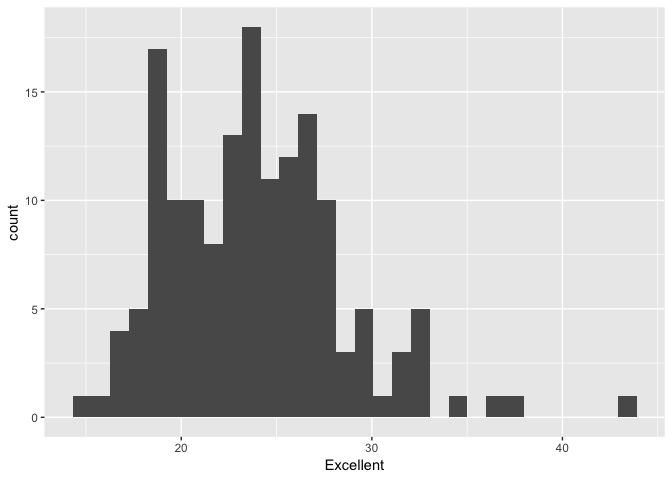
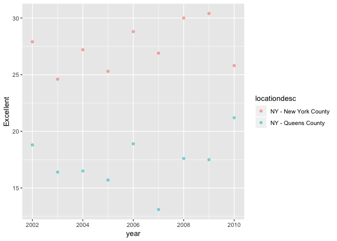

P8105\_hw2\_qw2282
================
Qinyao Wu
9/28/2018

``` r
#Import the data
nyc_transit_data = read.csv(file = "./data/NYC_Transit_Subway_Entrance_And_Exit_Data.csv") %>%
  janitor::clean_names() %>% 
  select(line, station_name, station_latitude, station_longitude, starts_with("route"), entry, vending, entrance_type, starts_with("ada")) %>% 
  mutate(entry = recode(entry, "YES" = TRUE, "NO" = FALSE))
```

This data set contains line, station\_name, station\_latitude, station\_longitude, route1, route2, route3, route4, route5, route6, route7, route8, route9, route10, route11, entry, vending, entrance\_type, ada, ada\_notes. These data are stored in a dataframe with 1868 rows and 20 columns. Up until now, I have cleaned up the variable names right after I imported the data from the data file. And I select the important columns and disregard the rest. and I have recode the content under the entry variable by changing the "Yes" and "No" into logical values TRUE and False. These data are not tidy yet because the there still a lot of unnecessary variables, such as the eleven different routes that can be combined into one variable.

``` r
distinct_station = distinct(nyc_transit_data, station_name,route1, .keep_all = TRUE)
dim(distinct_station)  #451 distinct stations.
```

    ## [1] 451  20

``` r
ada_com_distinction_station = filter(distinct_station, ada == TRUE)
dim(ada_com_distinction_station) #76 are ada complimented. 
```

    ## [1] 76 20

``` r
without_vending = filter(distinct_station, vending == "NO")
without_vending_allow_entry = 
  filter(distinct_station, vending == "NO", entry == TRUE)
proportion = nrow(without_vending_allow_entry) / nrow(without_vending) #55.6%
```

There are a total of 451 different stations, some of them are on the same street but serving different lines. 76 are ADA compliant. 55.5555556% of station entrances/ exits without vending that allow entrance.

``` r
transitdata_tidy = gather(nyc_transit_data, key = route_number, value = route_name, route1:route11)
```

    ## Warning: attributes are not identical across measure variables;
    ## they will be dropped

``` r
station_A_route = 
  filter(transitdata_tidy, route_name == "A") %>% 
  distinct(station_name, .keep_all = TRUE)  %>% #56 distinct stations serve A
  filter(ada == TRUE) #15 of them have ada.
```

There are a total of 56 distinct stations serve the A train. Of these stations, 15 are ADA complimant.

Problem 2
---------

``` r
#Import the data for Mr. trash wheeel. 
trash_wheel_data = readxl::read_excel("./data/HealthyHarborWaterWheelTotals2017-9-26.xlsx", sheet = 1, range = "A2:N258") %>% 
  janitor::clean_names() 

trash_wheel_data = filter(trash_wheel_data, !is.na(dumpster)) %>% 
  mutate(sports_balls = as.integer(round(sports_balls, 0)))

precipitation_2016 = readxl::read_excel("./data/HealthyHarborWaterWheelTotals2017-9-26.xlsx", sheet = 4, range = "A2:B15") %>% 
  janitor::clean_names() %>% 
  filter(!is.na(total)) %>% 
  mutate(year = 2016)
  
precipitation_2017 = readxl::read_excel("./data/HealthyHarborWaterWheelTotals2017-9-26.xlsx", sheet = 3, range = "A2:B15") %>% 
  janitor::clean_names() %>% 
  filter(!is.na(total)) %>% 
  mutate(year = 2017)

precipitation_tidy = bind_rows(precipitation_2016, precipitation_2017) %>%
  janitor::clean_names() %>% 
  mutate(month = month.name[month])
```

Mr. Trash Wheel data is stored in a dataframe with 215 rows and 14 columns. The dataset contains the following variables: dumpster, month, year, date, weight\_tons, volume\_cubic\_yards, plastic\_bottles, polystyrene, cigarette\_butts, glass\_bottles, grocery\_bags, chip\_bags, sports\_balls, homes\_powered. The rows indicates there are a total of 215 observations from 2014. Some key variables are the types of trash, such as the sports balls and cigaratte butts can all be catagorized into types of trash that Mr. Trash Wheel collected. In addition to the types of trash, the amount of trash can also be a key value because weight\_tons and volume\_cubic\_yards can be catagrized.

The precipitations for 2016 and 2017 are stored in two different dataframe.The dataframe of 2016 contains 13 rows and 3 columns. The dataframe of 2016 contains 9 rows and 3 columns. They both containing the following variables: month, total, year. I omitted rows that do not have precipitation data. Two dataframes for precipitation are combined and a new precipitation\_tidy dataframe is created. The total precipitation in 2017 is 59.86. The median number of sports balls in the dumster in 2016 is 26.

Problem 3
---------

``` r
library(p8105.datasets)
data(brfss_smart2010)


brfss_smart2010 = janitor::clean_names(brfss_smart2010) %>% 
  filter(topic == "Overall Health") %>% 
  select(-c(topic, class, question, sample_size, confidence_limit_low:geo_location)) %>% 
  spread( key = response, value = data_value)

#Unique locations
distinct_location = distinct(brfss_smart2010, locationdesc, .keep_all = TRUE) #total of 404 different locations

distinct_state = distinct(brfss_smart2010, locationabbr, .keep_all = TRUE) #51 states. 

tail(names(sort(table(brfss_smart2010$locationabbr))), 1) #NJ is the most frequently appeared states.
```

    ## [1] "NJ"

``` r
ggplot(filter(brfss_smart2010, year == 2002), aes(x = Excellent)) + geom_histogram()
```

    ## `stat_bin()` using `bins = 30`. Pick better value with `binwidth`.

    ## Warning: Removed 2 rows containing non-finite values (stat_bin).



``` r
ggplot(filter(brfss_smart2010, locationdesc == "NY - New York County" | locationdesc == "NY - Queens County"), aes(x = year, y = Excellent)) + geom_point(aes(color = locationdesc), alpha = .5)
```



There are a total of 404 locations are included in the dataset. And there are 51 states. Since there are a total of 51 states in United States, all the states are represented. In 2002, the median of the "Excellent" response value are 22.
